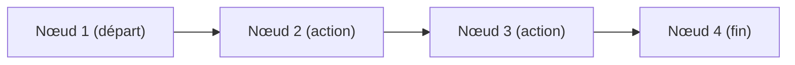
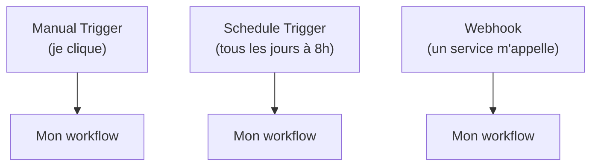
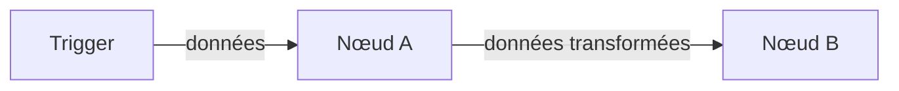
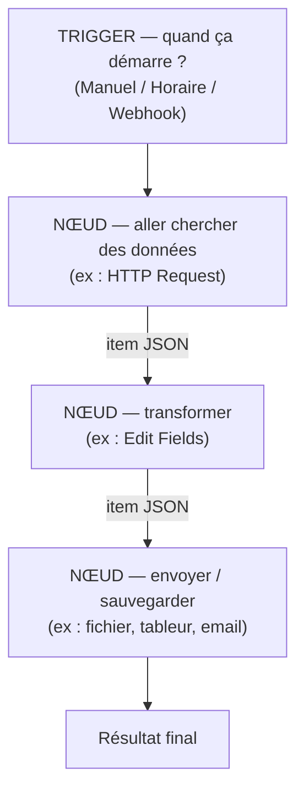

# Leçon 1 — Comprendre n8n : c'est quoi l'automatisation

> [!TIP]
> **Objectif de la Leçon 1 — Comprendre _le terrain de jeu_ avant de jouer.**
>
> Cette première leçon est entièrement théorique : on n'installe rien, on ne touche à aucun bouton. On apprend simplement à parler le langage de n8n, parce qu'on ne peut pas automatiser un système qu'on ne comprend pas.
>
> À la fin de cette leçon, tu sauras expliquer avec tes propres mots :
> 1. Ce qu'est **n8n** et à quoi sert l'**automatisation**.
> 2. Ce qu'est un **workflow** et de quoi il est fait.
> 3. Ce qu'est un **nœud** (« node ») et la différence entre un **trigger** et un **node d'action**.
> 4. Comment les données circulent d'un nœud à l'autre sous forme d'**items**.
>
> Retiens dès maintenant la phrase la plus importante de tout le cours : **un workflow n'est qu'une recette qui s'exécute toute seule.** Si tu sais décrire une suite d'étapes (« d'abord ceci, puis cela »), tu sais déjà penser comme n8n. Tout le reste de la formation repose sur cette idée.

## 1.1 C'est quoi n8n

n8n (prononcé « n-eight-n », pour *nodemation*) est un **outil d'automatisation**. Son rôle est de faire à ta place des tâches répétitives sur Internet : aller chercher une information sur un site, l'envoyer dans un tableur, prévenir quelqu'un par email, réagir quand un événement se produit, etc. Tu décris une fois la suite d'étapes à suivre, et n8n la rejoue ensuite automatiquement, autant de fois que tu veux.

La grande force de n8n, c'est qu'on construit ces automatisations **visuellement**, en reliant des boîtes entre elles avec la souris, sans avoir besoin d'écrire un long programme. Chaque boîte fait une petite chose précise, et les flèches indiquent l'ordre dans lequel les choses se passent.

> [!NOTE]
> **Analogie.** Imagine une chaîne de montage dans une usine. À l'entrée, une pièce arrive sur le tapis roulant. Chaque poste de travail fait **une seule opération** (visser, peindre, emballer), puis pousse la pièce vers le poste suivant. n8n, c'est exactement ça : un tapis roulant pour tes données, où chaque poste (un « nœud ») fait une petite action avant de passer la main au suivant.

On compare souvent n8n à des outils comme **Zapier** ou **Make**. La différence principale est que n8n peut s'installer **chez toi**, sur ton propre ordinateur (c'est ce qu'on va faire en Leçon 2 avec Docker). Tes données restent donc sur ta machine, et tu peux l'utiliser gratuitement pour apprendre, sans limite de nombre de tâches.

## 1.2 C'est quoi l'automatisation (et pourquoi c'est utile)

Automatiser, c'est confier à une machine une tâche que tu ferais sinon à la main, encore et encore. Le but n'est pas de remplacer ton intelligence, mais de te libérer des gestes mécaniques et répétitifs pour que la machine les fasse à ta place, sans se fatiguer ni se tromper.

Prenons trois exemples très simples de la vie réelle, que tu sauras d'ailleurs construire à la fin de ce cours :

- Chaque matin à 8 h, aller chercher une **citation inspirante** sur Internet et l'enregistrer dans un fichier.
- Quand quelqu'un **remplit un formulaire** sur ton site, recevoir l'information et répondre automatiquement.
- Prendre une liste de données venant d'une **API** (un service en ligne) et la **sauvegarder** ligne par ligne dans un tableur.

Le point commun de ces trois exemples ? Ce sont des suites d'étapes claires : « quand X arrive, fais Y, puis Z ». C'est précisément ce que n8n sait faire.

## 1.3 Le workflow : la recette complète

Un **workflow** (qu'on peut traduire par « flux de travail ») est l'unité de base de n8n : c'est **une automatisation complète**, du début à la fin. C'est l'équivalent d'une recette de cuisine entière, avec toutes ses étapes mises bout à bout.

Un workflow est composé de deux choses seulement :

- des **nœuds** (les étapes, les « boîtes ») ;
- des **connexions** (les flèches qui relient les boîtes et donnent l'ordre d'exécution).



Quand tu **exécutes** un workflow, n8n part du premier nœud et suit les flèches une par une, dans l'ordre, jusqu'au dernier. Chaque nœud reçoit les données du nœud précédent, fait son travail, puis transmet le résultat au nœud suivant. Un workflow peut être tout petit (deux nœuds) ou très grand (des dizaines de nœuds) : la logique reste toujours la même.

## 1.4 Le nœud (« node ») : une étape, une action

Un **nœud** est une boîte qui réalise **une seule opération bien précise**. C'est la brique élémentaire de toute automatisation n8n. Il existe des centaines de nœuds différents, mais ils appartiennent tous à l'une de ces grandes familles :

- Les nœuds qui **vont chercher** des données quelque part (par exemple le nœud **HTTP Request**, qui interroge un site web ou une API).
- Les nœuds qui **transforment** des données (par exemple **Edit Fields**, qui modifie ou ajoute des informations).
- Les nœuds qui **décident** d'un chemin (par exemple **IF**, qui sépare en « oui » et « non »).
- Les nœuds qui **envoient** des données ailleurs (vers un email, un tableur, un fichier...).

> [!NOTE]
> **Analogie.** Un nœud est comme une **application sur ton téléphone**. L'application « Météo » fait une chose (te donner la météo), l'application « Calculatrice » en fait une autre. Tu ne demandes pas à la calculatrice de t'afficher la météo. De la même façon, chaque nœud n8n a un rôle unique : tu choisis le bon nœud pour la bonne tâche, et tu les enchaînes.

L'avantage de ce découpage est qu'il rend tout **lisible**. En regardant la suite des boîtes, n'importe qui peut comprendre ce que fait ton automatisation, comme on lit les étapes numérotées d'une recette.

## 1.5 Le trigger : ce qui déclenche le workflow

Parmi tous les nœuds, il en existe un type très particulier : le **trigger** (« déclencheur »). C'est **toujours le tout premier nœud** d'un workflow, et c'est lui qui répond à la question : **« quand est-ce que ça démarre ? »**.

Sans trigger, un workflow ne peut jamais se lancer tout seul. Voici les trois triggers que tu utiliseras le plus en débutant :

| Trigger | Quand il déclenche | Exemple |
|---------|--------------------|---------|
| **Manual Trigger** | Quand **toi** tu cliques sur « Exécuter » | Tester un workflow pendant que tu le construis |
| **Schedule Trigger** | À une **heure** ou un **intervalle** précis | « Tous les jours à 8 h », « toutes les 15 minutes » |
| **Webhook** | Quand un **autre service t'envoie** une information | « Quand un formulaire est rempli » |



> [!NOTE]
> **Analogie.** Le trigger est comme la **sonnette de ta porte**. Tant que personne ne sonne (manuel), ou que le réveil ne sonne pas (horaire), ou qu'aucun visiteur n'arrive (webhook), rien ne se passe dans la maison. C'est la sonnerie qui met tout le reste en mouvement.

Retiens bien cette règle simple : **tout workflow commence par exactement un trigger**, puis enchaîne les nœuds d'action. En Leçon 3, ton tout premier workflow utilisera un Manual Trigger, le plus simple de tous.

## 1.6 Les connexions : l'ordre des étapes

Les **connexions** sont les flèches qui relient les nœuds entre eux. Elles ne font pas seulement « joli » : elles indiquent à n8n **dans quel ordre** exécuter les nœuds, et **quelles données** passent de l'un à l'autre.

Une flèche part toujours de la **sortie** d'un nœud (à sa droite) et arrive sur l'**entrée** du nœud suivant (à sa gauche). La règle est limpide : un nœud ne s'exécute que lorsque les données lui parviennent par une flèche entrante.



C'est ce système de flèches qui transforme une simple collection de boîtes en une **recette ordonnée**. Change l'ordre des flèches, et tu changes l'ordre des opérations — exactement comme inverser deux étapes d'une recette change le plat final.

## 1.7 Les items : comment voyagent les données

Voici la notion la plus importante pour bien comprendre n8n. Entre les nœuds, les données ne voyagent pas en vrac : elles voyagent sous forme d'**items**. Un **item** est un petit paquet d'informations, généralement au format **JSON** (une façon standard d'écrire des données avec des paires « nom : valeur »).

Voici à quoi ressemble un item tout simple :

```json
{
  "prenom": "Léa",
  "ville": "Montréal",
  "age": 29
}
```

Un nœud reçoit un (ou plusieurs) items en entrée, fait son travail, et renvoie un (ou plusieurs) items en sortie. Par exemple, un nœud HTTP Request qui interroge une API de citations pourrait produire cet item :

```json
{
  "citation": "Le meilleur moment pour planter un arbre était il y a 20 ans.",
  "auteur": "Proverbe"
}
```

> [!NOTE]
> **Analogie.** Un item est comme une **fiche cartonnée** que l'on passe de main en main sur la chaîne de montage. Chaque poste lit la fiche, écrit dessus ou la complète, puis la transmet au poste suivant. Quand plusieurs fiches arrivent en même temps (par exemple 10 lignes d'un tableur), chaque poste traite **les 10 fiches**, une par une.

Comprendre les items est la clé pour relier les nœuds correctement : dans un nœud, tu pourras toujours « piocher » dans les données de l'item venant du nœud précédent (par exemple écrire `{{ $json.citation }}` pour réutiliser la citation). On verra cette syntaxe dès la Leçon 3, pas à pas.

## 1.8 Vue globale d'un workflow n8n (synthèse)

Rassemblons maintenant toutes les pièces dans une seule image mentale. Un workflow démarre **toujours** par un trigger, puis fait circuler des **items** à travers une suite de **nœuds** reliés par des **connexions**, jusqu'à un résultat final.



Ce schéma résume toute la logique de la formation : on **déclenche** (trigger), on **récupère** des données, on les **transforme** si besoin, puis on les **envoie** quelque part. Chacun des trois projets simples de ce cours (Leçons 4, 5 et 6) n'est qu'une variation de ce même schéma de base.

## Recap

> [!TIP]
> **Avant de passer à la Leçon 2, assure-toi de pouvoir réexpliquer ces notions avec tes propres mots :**
>
> 1. Ce qu'est **n8n** et à quoi sert l'**automatisation**.
> 2. Ce qu'est un **workflow** (une recette complète : des nœuds + des connexions).
> 3. Ce qu'est un **nœud** et le principe « une boîte = une action ».
> 4. Ce qu'est un **trigger** et les trois types : **Manuel**, **Schedule**, **Webhook**.
> 5. Le rôle des **connexions** (l'ordre des étapes).
> 6. Ce qu'est un **item** et comment les données circulent en **JSON**.
>
> **Et n'oublie jamais la phrase fondatrice : un workflow n'est qu'une recette qui s'exécute toute seule.**

Dans la **Leçon 2**, on quitte la théorie pour passer à la pratique : on va **installer n8n sur ton ordinateur** grâce à Docker Desktop et à un fichier `docker-compose.yml`, sans rien installer d'autre. À la fin, tu auras n8n qui tourne sur `http://localhost:5678`, prêt pour ton premier workflow.
