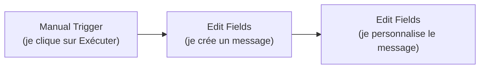
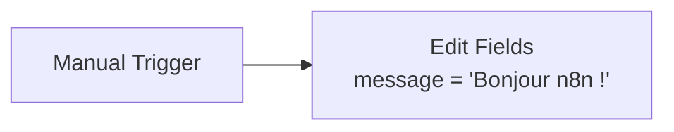

# Leçon 3 — Ton premier workflow : « Hello n8n »

> [!TIP]
> **Objectif de la Leçon 3 — Construire, de tes mains, le workflow le plus simple possible.**
>
> Ce document est un **mode d'emploi pas à pas**. On ne va chercher aucune donnée sur Internet : on reste à l'intérieur de n8n pour bien comprendre les bases avant les vrais projets.
>
> Tu trouveras aussi un **workflow importable** : [`workflow-01-hello.json`](workflow-01-hello.json).
>
> À la fin de cette leçon, tu sauras :
> 1. Créer un workflow et y ajouter un **Manual Trigger**.
> 2. Ajouter un nœud **Edit Fields (Set)** pour fabriquer une donnée.
> 3. **Exécuter** le workflow et **lire le résultat** (les items en JSON).
> 4. Réutiliser une donnée d'un nœud dans un autre avec les **expressions** `{{ }}`.
> 5. **Sauvegarder** ton travail.
>
> Phrase clé : **si tu sais faire ces 3 nœuds, tu sais faire n8n — tout le reste n'est qu'une variation.**

---

## Vue d'ensemble du workflow



C'est tout. Trois petites boîtes. On démarre à la main, on crée un texte, puis on le transforme. L'objectif n'est pas le résultat (qui est minuscule) mais de **maîtriser les gestes** que tu répéteras dans tous tes futurs workflows.

---

# PARTIE 1 — Créer le workflow et le trigger

Assure-toi d'abord que n8n tourne (Leçon 2 : `docker compose up -d`) et ouvre **`http://localhost:5678`**.

## 1.1 Créer un nouveau workflow

1. Sur l'écran d'accueil, clique sur **« + »** ou **« Create Workflow »** (en haut à droite).
2. Tu arrives sur une **toile vide** (le « canvas »), avec un grand bouton **« Add first step »** au centre.

C'est ici que tu construis ton automatisation, en posant des nœuds et en les reliant.

## 1.2 Ajouter le Manual Trigger

Comme vu en Leçon 1, **tout workflow commence par un trigger**. On prend le plus simple : celui qui démarre quand **toi** tu cliques.

1. Clique sur **« Add first step »**.
2. Dans la liste, choisis **« Trigger manually »** (parfois affiché « On clicking 'Execute workflow' » / **Manual Trigger**).
3. Un nœud apparaît sur la toile, nommé quelque chose comme **« When clicking 'Execute workflow' »**.

> [!NOTE]
> **Pourquoi le manuel pour commencer ?** Parce qu'il te laisse le contrôle total : rien ne part tant que tu ne cliques pas. C'est parfait pour apprendre et pour tester, sans risque de déclenchement surprise. On verra les triggers automatiques (horaire, webhook) dès la Leçon 4.

---

# PARTIE 2 — Ajouter un nœud Edit Fields (Set)

Le nœud **Edit Fields** (anciennement appelé **Set**) sert à **créer ou modifier des données**. C'est l'un des nœuds les plus utilisés : on s'en sert pour fabriquer une valeur, renommer un champ, ou préparer des données pour l'étape suivante.

## 2.1 Ajouter le nœud

1. Sur le nœud Manual Trigger, repère le petit **« + »** à sa **droite** (la sortie).
2. Clique dessus : un panneau de recherche de nœuds s'ouvre.
3. Tape **« Edit Fields »** et choisis le nœud **« Edit Fields (Set) »**.
4. Il se place automatiquement à droite du trigger, **déjà relié** par une flèche.

## 2.2 Créer un champ « message »

Double-clique sur le nœud Edit Fields pour l'ouvrir, puis :

1. Assure-toi que le mode est sur **« Manual Mapping »** (saisie manuelle).
2. Clique sur **« Add Field »** (ajouter un champ).
3. Remplis :
   - **Name** (nom du champ) : `message`
   - **Type** : `String` (texte)
   - **Value** (valeur) : `Bonjour n8n !`



Tu viens de dire à n8n : « fabrique-moi un item qui contient un champ `message` valant *Bonjour n8n !* ».

## 2.3 Exécuter et lire le résultat

C'est le moment de vérité.

1. En bas (ou en haut à droite), clique sur le bouton **« Execute workflow »** (ou « Test workflow »).
2. Les nœuds passent au **vert** : ils se sont exécutés sans erreur.
3. Ouvre le nœud Edit Fields : à droite, dans le panneau **OUTPUT**, tu vois le résultat.

Le résultat affiché doit ressembler à ceci (vue **JSON**) :

```json
{
  "message": "Bonjour n8n !"
}
```

> [!NOTE]
> **Les vues Table / JSON / Schema.** Dans le panneau OUTPUT, tu peux basculer entre plusieurs affichages. La vue **Table** montre les données comme un tableur (pratique). La vue **JSON** montre la structure brute de l'item (celle qui voyage entre les nœuds, vue en Leçon 1). La vue **Schema** liste juste les noms des champs. Pour apprendre, regarde souvent la vue **JSON** : c'est la « vérité ».

Si tu vois ce JSON, **félicitations** : tu viens d'exécuter ton premier workflow et de produire ton premier item de données.

---

# PARTIE 3 — Réutiliser une donnée avec les expressions

Maintenant, le concept qui débloque **tout** dans n8n : les **expressions**. Une expression permet à un nœud d'aller **piocher** dans les données d'un nœud précédent, au lieu d'écrire une valeur figée.

## 3.1 Ajouter un deuxième Edit Fields

1. Sur le nœud Edit Fields existant, clique sur le **« + »** à sa droite.
2. Ajoute un nouveau nœud **« Edit Fields (Set) »**. (Il y a maintenant deux nœuds Edit Fields à la suite.)

## 3.2 Construire un message personnalisé

Ouvre ce **deuxième** nœud Edit Fields :

1. Clique sur **« Add Field »**.
2. **Name** : `message_final`
3. **Type** : `String`
4. Pour la **Value**, on ne tape pas un texte figé : on utilise une **expression**. Passe le champ en mode **expression** (clique sur le petit engrenage / l'onglet **« Expression »** à côté du champ), puis saisis :

```
Le robot dit : {{ $json.message }} 🤖
```

Ici, `{{ $json.message }}` signifie : « va chercher le champ `message` dans l'item qui arrive du nœud précédent ». n8n remplace cette expression par la vraie valeur au moment de l'exécution.

> [!NOTE]
> **Décoder `{{ $json.message }}`.** Les doubles accolades `{{ }}` annoncent une expression. `$json` représente **l'item courant** (celui qui entre dans ce nœud). `.message` est le **nom du champ** qu'on veut lire. Donc `{{ $json.message }}` = « la valeur du champ `message` de l'item entrant ». C'est exactement la circulation des items vue en Leçon 1, mise en pratique.

## 3.3 Exécuter et vérifier

Relance **« Execute workflow »**, puis ouvre le deuxième nœud Edit Fields. Sa sortie doit contenir les deux champs :

```json
{
  "message": "Bonjour n8n !",
  "message_final": "Le robot dit : Bonjour n8n ! 🤖"
}
```

Observe bien : le champ `message` est **toujours là** (il vient du premier nœud et a été transmis), et `message_final` a été **calculé** à partir de lui. Tu viens de faire circuler **et** transformer une donnée — le cœur de n8n.

> [!NOTE]
> **Le glisser-déposer, encore plus simple.** Plutôt que de taper `{{ $json.message }}` à la main, tu peux, dans le panneau de gauche (**INPUT**), **glisser-déposer** le champ `message` directement dans la case Value. n8n écrit l'expression pour toi. Au début, fais-le à la main une ou deux fois pour comprendre, puis utilise le glisser-déposer au quotidien.

---

# PARTIE 4 — Nommer et sauvegarder

Un workflow non sauvegardé est un workflow perdu au prochain rafraîchissement.

1. En haut à gauche, clique sur le titre **« My workflow »** et renomme-le, par exemple : **`01 - Hello n8n`**.
2. Clique sur **« Save »** (en haut à droite).

Grâce au volume `./n8n_data` configuré en Leçon 2, ce workflow est maintenant stocké **sur ta machine** et survivra à un redémarrage de Docker.

---

# PARTIE 5 — Importer le workflow tout fait (optionnel)

Si tu veux comparer ton travail avec une version de référence, importe le fichier fourni :

1. Dans n8n, en haut à droite, ouvre le menu **« ⋮ »** (trois points) → **« Import from File... »**.
2. Sélectionne [`workflow-01-hello.json`](workflow-01-hello.json) (dans ce dossier).
3. Le workflow apparaît, complet et relié. Clique sur **« Execute workflow »** pour le voir tourner.

> [!NOTE]
> **À quoi sert l'import ?** C'est ainsi qu'on **partage** des workflows. Tu peux exporter les tiens (`menu ⋮ → Download`) pour les sauvegarder ou les donner à quelqu'un, et importer ceux des autres. Tous les projets de ce cours sont fournis en `.json` importable.

---

# PARTIE 6 — Erreurs fréquentes et solutions

| Symptôme | Cause probable | Solution |
|----------|----------------|----------|
| Le nœud reste **gris**, rien ne s'exécute | Tu n'as pas cliqué sur « Execute workflow » | Clique sur le bouton d'exécution |
| `{{ $json.message }}` s'affiche **tel quel** (texte brut) | Le champ est resté en mode « fixe », pas en mode expression | Repasse le champ en mode **Expression** |
| `message` est **vide** dans la sortie | Le nom du champ ne correspond pas (`Message` ≠ `message`) | Vérifie la **casse** : les noms sont sensibles aux majuscules |
| Le nœud est **rouge** | Une erreur de configuration | Ouvre le nœud, lis le message d'erreur en haut |
| Mon workflow a **disparu** | Pas sauvegardé, ou volume manquant | Clique toujours sur **Save** ; vérifie le volume `./n8n_data` |

---

## Recap

> [!TIP]
> **Tu maîtrises maintenant les gestes de base de n8n :**
>
> 1. **Créer** un workflow et ajouter un **Manual Trigger**.
> 2. Ajouter un nœud **Edit Fields (Set)** et y **créer un champ** (`message`).
> 3. **Exécuter** le workflow et **lire la sortie** en vue JSON.
> 4. Utiliser une **expression** `{{ $json.message }}` pour réutiliser une donnée d'un nœud précédent.
> 5. **Nommer** et **sauvegarder** ton workflow.
> 6. **Importer / exporter** un workflow en `.json`.
>
> **Retiens : si tu sais faire ces 3 nœuds, tu sais faire n8n — tout le reste n'est qu'une variation.**

Dans la **Leçon 4**, on construit ton **premier vrai projet utile** : aller chercher une **citation du jour** sur une API publique gratuite, automatiquement, grâce au **Schedule Trigger** et au nœud **HTTP Request**.
