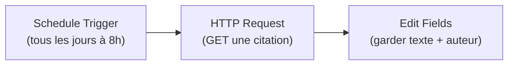
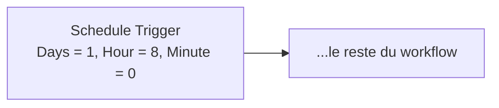

# Leçon 4 — Projet 1 : la citation du jour (Schedule + HTTP Request)

> [!TIP]
> **Objectif — Construire ton premier projet _utile_ : aller chercher une donnée sur Internet, tout seul, chaque jour.**
>
> Ce document est un **mode d'emploi pas à pas**. Chaque nœud est décrit avec ses réglages exacts, l'URL appelée et la donnée reçue.
>
> Tu trouveras aussi un **workflow importable** : [`workflow-02-citation.json`](workflow-02-citation.json).
>
> À la fin de cette leçon, tu sauras :
> 1. Utiliser un **Schedule Trigger** pour lancer un workflow à heure fixe.
> 2. Appeler une **API publique gratuite** avec le nœud **HTTP Request**.
> 3. **Lire la réponse** d'une API et en extraire le champ qui t'intéresse.
> 4. **Nettoyer** le résultat avec un nœud Edit Fields.
>
> Phrase clé : **la moitié de l'automatisation sur Internet, c'est « appeler une API et lire sa réponse ».**

---

## Vue d'ensemble du projet



Le principe : chaque matin, n8n interroge un service en ligne qui renvoie une citation au hasard, puis on garde uniquement les informations utiles. Pendant qu'on construit, on testera **à la main** ; le déclenchement automatique ne sera activé qu'à la fin.

---

# PARTIE 0 — C'est quoi une API (rappel express)

Une **API** est une « porte d'entrée » qu'un service met à disposition pour qu'on lui demande des données par programme. Tu envoies une **requête** à une **URL**, et le service te renvoie une **réponse**, presque toujours en **JSON** (le format vu en Leçon 1).

On va utiliser une API **gratuite et sans inscription** qui renvoie une citation au hasard. L'URL est :

```
https://api.quotable.io/random
```

> [!NOTE]
> **Teste l'URL toi-même.** Avant de toucher à n8n, copie cette URL dans un onglet de navigateur. Tu verras s'afficher un texte JSON, du genre `{"content":"...","author":"..."}`. C'est exactement ce que n8n recevra. **Toujours tester une API dans le navigateur d'abord** : ça confirme qu'elle marche et te montre la forme de la réponse.

La réponse ressemble à ceci (les champs qui nous intéressent sont `content` et `author`) :

```json
{
  "content": "Le succès, c'est tomber sept fois et se relever huit.",
  "author": "Proverbe japonais",
  "tags": ["wisdom"],
  "length": 52
}
```

> [!NOTE]
> **Si `api.quotable.io` ne répond pas.** Les API publiques gratuites changent parfois. Deux solutions de secours qui renvoient aussi une citation : `https://zenquotes.io/api/random` (la réponse est une **liste**, on lira alors `[0].q` et `[0].a`) ou `https://dummyjson.com/quotes/random` (champs `quote` et `author`). La méthode reste identique ; seuls les noms de champs changent.

---

# PARTIE 1 — Le Schedule Trigger

Le **Schedule Trigger** déclenche le workflow à un **moment** ou un **intervalle** que tu choisis. C'est lui qui rend l'automatisation « autonome » : plus besoin de cliquer.

## 1.1 Créer le workflow et ajouter le trigger

1. Crée un nouveau workflow (bouton **« + »**).
2. **« Add first step »** → cherche **« Schedule Trigger »** → ajoute-le.

## 1.2 Régler l'horaire

Ouvre le nœud Schedule Trigger :

- **Trigger Interval** : choisis **« Days »** (jours).
- **Days Between Triggers** : `1` (tous les jours).
- **Trigger at Hour** : `8` (8 h du matin).
- **Trigger at Minute** : `0`.



> [!NOTE]
> **Le fuseau horaire compte.** « 8 h » signifie 8 h dans le fuseau réglé en Leçon 2 (`GENERIC_TIMEZONE=America/Toronto`). Si tes déclenchements arrivent à la mauvaise heure, c'est presque toujours le fuseau qu'il faut corriger dans le `docker-compose.yml`, puis relancer `docker compose up -d`.

> [!NOTE]
> **Pendant qu'on construit, on n'attend pas 8 h !** Le Schedule Trigger ne se déclenche tout seul **que lorsque le workflow est actif** (interrupteur en haut à droite). Pendant la construction, on utilise le bouton **« Execute workflow »** pour tester immédiatement, à la demande. On activera l'automatique seulement à la fin (Partie 5).

---

# PARTIE 2 — Le nœud HTTP Request

Le nœud **HTTP Request** est sans doute le plus puissant de n8n : il sait parler à **n'importe quelle API** sur Internet. Ici, on l'utilise dans sa forme la plus simple : un **GET** (= « donne-moi des données »).

## 2.1 Ajouter et régler le nœud

1. Sur le Schedule Trigger, clique le **« + »** → cherche **« HTTP Request »** → ajoute-le.
2. Ouvre-le et règle :

| Réglage | Valeur |
|---------|--------|
| **Method** | `GET` |
| **URL** | `https://api.quotable.io/random` |
| **Authentication** | `None` (cette API est libre) |

Laisse tous les autres réglages par défaut. C'est suffisant pour une API publique simple.

## 2.2 Exécuter et lire la réponse

1. Clique sur **« Execute workflow »** (ou « Execute step » sur ce seul nœud).
2. Dans le panneau **OUTPUT**, bascule en vue **JSON**.

Tu dois voir la réponse complète de l'API, avec notamment :

```json
{
  "content": "Le succès, c'est tomber sept fois et se relever huit.",
  "author": "Proverbe japonais",
  "tags": ["wisdom"],
  "length": 52
}
```

> [!NOTE]
> **Tu viens de récupérer une donnée vivante d'Internet.** Relance « Execute » plusieurs fois : la citation **change** à chaque fois, puisque l'API en renvoie une au hasard. C'est la preuve que n8n parle bien au service en direct.

---

# PARTIE 3 — Garder seulement l'utile (Edit Fields)

La réponse contient des champs dont on n'a pas besoin (`tags`, `length`). On va utiliser un nœud **Edit Fields** pour ne conserver que la citation et son auteur, proprement présentés.

## 3.1 Ajouter le nœud

1. Sur le nœud HTTP Request, clique le **« + »** → ajoute **« Edit Fields (Set) »**.
2. Ouvre-le et active l'option **« Keep Only Set Fields »** (ne garder que les champs définis ici) si tu veux un résultat épuré.

## 3.2 Définir les champs

Ajoute deux champs (bouton **« Add Field »**), en mode **Expression** pour la valeur :

| Name | Type | Value (expression) |
|------|------|--------------------|
| `citation` | String | `={{ $json.content }}` |
| `auteur` | String | `={{ $json.author }}` |

Tu peux aussi ajouter un champ « tout fait », bien lisible :

| Name | Type | Value (expression) |
|------|------|--------------------|
| `message` | String | `={{ $json.content }} — {{ $json.author }}` |

> [!NOTE]
> **D'où viennent `content` et `author` ?** Ce sont les noms **exacts** des champs renvoyés par l'API (vus en Partie 2.2). C'est pour ça qu'on teste toujours l'API d'abord : pour connaître les noms à mettre après `$json.`. Si tu utilises une API de secours (Partie 0), adapte ces noms (par exemple `$json.quote` au lieu de `$json.content`).

## 3.3 Exécuter et vérifier le résultat final

Relance **« Execute workflow »** et ouvre le nœud Edit Fields. Sa sortie doit être nette :

```json
{
  "citation": "Le succès, c'est tomber sept fois et se relever huit.",
  "auteur": "Proverbe japonais",
  "message": "Le succès, c'est tomber sept fois et se relever huit. — Proverbe japonais"
}
```

Bravo : tu as un workflow qui va chercher une donnée sur Internet et la présente proprement. C'est déjà un vrai mini-outil.

---

# PARTIE 4 — Importer le workflow tout fait (optionnel)

1. Menu **« ⋮ »** → **« Import from File... »**.
2. Sélectionne [`workflow-02-citation.json`](workflow-02-citation.json).
3. Le workflow apparaît, complet. Clique sur **« Execute workflow »** pour le tester.

---

# PARTIE 5 — Activer le déclenchement automatique

Tant que le workflow est en mode « brouillon », il ne tourne que quand tu cliques. Pour qu'il se déclenche **tout seul à 8 h** :

1. **Sauvegarde** le workflow (nomme-le `02 - Citation du jour`).
2. En haut à droite, bascule l'interrupteur **« Inactive » → « Active »**.

Désormais, n8n exécutera ce workflow chaque jour à 8 h, **même si tu ne l'as pas ouvert**, tant que Docker tourne.

> [!NOTE]
> **Tester sans attendre demain.** Pour vérifier que l'automatique marche sans attendre 8 h, règle temporairement le Schedule sur **« Seconds » / 30** (toutes les 30 secondes), active le workflow, et observe les exécutions dans l'onglet **« Executions »** (à gauche). Une fois rassuré, remets-le sur **Days / 8h** et resauvegarde.

---

# PARTIE 6 — Erreurs fréquentes et solutions

| Symptôme | Cause probable | Solution |
|----------|----------------|----------|
| `ECONNREFUSED` / `getaddrinfo ENOTFOUND` | Pas d'accès Internet depuis le conteneur, ou URL mal tapée | Vérifie l'URL et ta connexion ; teste l'URL dans le navigateur |
| Réponse reçue mais `citation` **vide** | Mauvais nom de champ après `$json.` | Regarde la vraie sortie du HTTP Request et corrige (`content`, `quote`...) |
| `403` / `429` | L'API limite les appels ou bloque | Attends un peu, ou utilise une API de secours (Partie 0) |
| Le workflow ne part pas à 8 h | Workflow resté **Inactive**, ou Docker éteint | Passe-le **Active** ; garde Docker démarré |
| Mauvaise heure de déclenchement | Fuseau horaire | Corrige `GENERIC_TIMEZONE` dans `docker-compose.yml` |

---

## Recap

> [!TIP]
> **Tu as construit ton premier projet autonome :**
>
> 1. Un **Schedule Trigger** réglé pour partir tous les jours à 8 h.
> 2. Un nœud **HTTP Request** (GET) qui appelle une **API publique gratuite**.
> 3. La **lecture de la réponse** JSON et l'identification des bons champs (`content`, `author`).
> 4. Un nœud **Edit Fields** pour ne garder que l'utile et fabriquer un `message` propre.
> 5. L'**activation** du workflow pour qu'il tourne tout seul.
>
> **Retiens : la moitié de l'automatisation sur Internet, c'est « appeler une API et lire sa réponse ».**

Dans la **Leçon 5**, on inverse le sens : au lieu d'aller chercher des données, on va **en recevoir**. Tu vas créer un **Webhook**, une porte d'entrée qui réagit quand un autre service (ou un formulaire) t'envoie une information.
