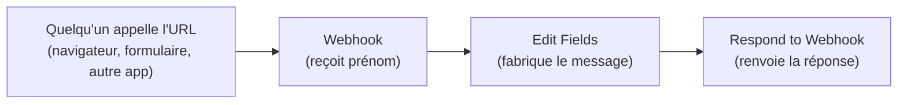
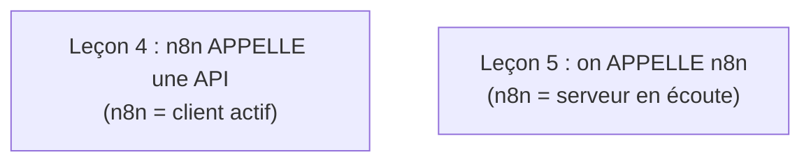
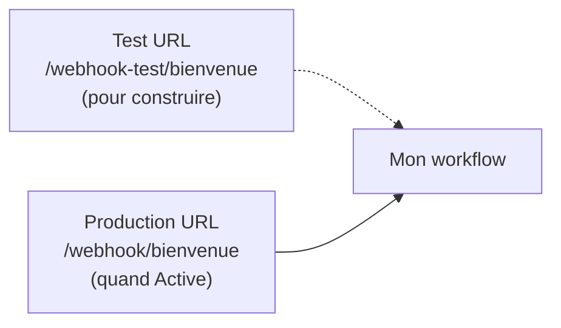
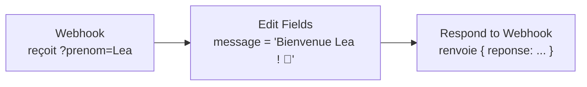

# Leçon 5 — Projet 2 : un mini-webhook (recevoir et répondre)

> [!TIP]
> **Objectif — Créer une « porte d'entrée » qui réagit quand on lui envoie une information.**
>
> Ce document est un **mode d'emploi pas à pas**. On va construire un webhook qui reçoit un prénom et renvoie un message de bienvenue personnalisé.
>
> Tu trouveras aussi un **workflow importable** : [`workflow-03-webhook.json`](workflow-03-webhook.json).
>
> À la fin de cette leçon, tu sauras :
> 1. Ce qu'est un **webhook** et la différence avec « aller chercher » des données.
> 2. Créer un nœud **Webhook** et obtenir son **URL de test** et de **production**.
> 3. **Lire les données reçues** (query, body) envoyées par l'appelant.
> 4. Renvoyer une réponse avec le nœud **Respond to Webhook**.
> 5. **Tester** ton webhook depuis le navigateur et avec `curl`.
>
> Phrase clé : **un webhook, c'est ton numéro de téléphone — les autres t'appellent, et tu décroches.**

---

## Vue d'ensemble du projet



En Leçon 4, **n8n** allait chercher des données (il appelait, il était « actif »). Ici, c'est l'inverse : n8n **attend** qu'on l'appelle (il est « passif », en écoute). Cette inversion est la deuxième grande façon de déclencher un workflow.

---

# PARTIE 0 — C'est quoi un webhook

Un **webhook** est une **URL spéciale** que n8n met à ta disposition. Quand un autre programme (un site, un formulaire, une autre application, ou simplement ton navigateur) **visite cette URL**, ça **déclenche** ton workflow et lui transmet les données de l'appel.



> [!NOTE]
> **Analogie.** Le HTTP Request (Leçon 4) revient à **téléphoner** à quelqu'un pour demander une info. Le Webhook (Leçon 5) revient à **donner ton numéro** : tu attends, et c'est l'autre qui t'appelle. Quand le téléphone sonne (l'URL est visitée), le workflow démarre.

C'est le mécanisme derrière des phrases comme « **quand** un client paie, **alors** envoie un email » ou « **quand** un formulaire est rempli, **alors** enregistre la réponse ». Le « quand » est le webhook.

---

# PARTIE 1 — Créer le nœud Webhook

## 1.1 Ajouter le trigger Webhook

1. Crée un nouveau workflow.
2. **« Add first step »** → cherche **« Webhook »** → ajoute-le. C'est un **trigger** (premier nœud).

## 1.2 Régler le webhook

Ouvre le nœud Webhook :

| Réglage | Valeur | Pourquoi |
|---------|--------|----------|
| **HTTP Method** | `GET` | On testera facilement depuis le navigateur |
| **Path** | `bienvenue` | Le bout d'URL personnalisé |
| **Respond** | `Using 'Respond to Webhook' node` | On renverra une réponse construite par nous |

## 1.3 Comprendre les deux URL

En haut du nœud, n8n affiche **deux URL** :

- **Test URL** : `http://localhost:5678/webhook-test/bienvenue` → active **seulement** quand tu cliques « Listen for test event ». Sert à construire/déboguer.
- **Production URL** : `http://localhost:5678/webhook/bienvenue` → active **en permanence** dès que le workflow est **Active**.



> [!NOTE]
> **Test vs Production, l'erreur n°1 des débutants.** Pendant la construction, tu **dois** utiliser la **Test URL** ET cliquer sur **« Listen for test event »** avant d'appeler l'URL : sinon n8n répond « webhook not registered ». En production, tu utilises la **Production URL** et le workflow doit être **Active**. Ce sont deux mondes séparés.

---

# PARTIE 2 — Recevoir des données et les lire

On veut que l'appelant nous envoie un **prénom**. Avec une méthode GET, le plus simple est de le passer dans l'URL sous forme de **paramètre de requête** (« query parameter ») : `?prenom=Lea`.

## 2.1 Écouter un événement de test

1. Dans le nœud Webhook, clique sur **« Listen for test event »**. n8n se met en écoute (compte à rebours).
2. Ouvre un nouvel onglet de navigateur et visite la **Test URL** en ajoutant le prénom :

```
http://localhost:5678/webhook-test/bienvenue?prenom=Lea
```

3. Reviens dans n8n : le webhook a **capté l'appel** et affiche les données reçues.

## 2.2 Lire la donnée reçue

Dans la sortie du nœud Webhook, repère où se trouve le prénom. Pour un paramètre de requête, il est rangé dans `query` :

```json
{
  "headers": { "...": "..." },
  "params": {},
  "query": {
    "prenom": "Lea"
  },
  "body": {}
}
```

Le chemin vers le prénom est donc : **`{{ $json.query.prenom }}`**.

> [!NOTE]
> **query vs body.** Les données envoyées **dans l'URL** (après le `?`) arrivent dans **`query`**. Les données envoyées **dans le corps** d'une requête POST (par un formulaire ou une autre app) arrivent dans **`body`** (ex. `{{ $json.body.prenom }}`). On utilise GET + `query` ici parce que c'est le plus facile à tester au navigateur.

---

# PARTIE 3 — Fabriquer le message (Edit Fields)

1. Sur le nœud Webhook, clique le **« + »** → ajoute **« Edit Fields (Set) »**.
2. Ajoute un champ, en mode **Expression** :

| Name | Type | Value (expression) |
|------|------|--------------------|
| `message` | String | `=Bienvenue {{ $json.query.prenom }} ! 🎉` |

3. Clique **« Execute step »** pour vérifier. Sortie attendue :

```json
{
  "message": "Bienvenue Lea ! 🎉"
}
```

> [!NOTE]
> **Gérer le cas « pas de prénom ».** Si quelqu'un appelle l'URL sans `?prenom=...`, le champ sera vide. Tu peux prévoir une valeur par défaut avec une expression un peu plus riche : `=Bienvenue {{ $json.query.prenom || "visiteur" }} !`. Le `||` signifie « ou, à défaut ». C'est une bonne habitude pour des webhooks robustes.

---

# PARTIE 4 — Renvoyer la réponse (Respond to Webhook)

Comme on a réglé le webhook sur **« Using Respond to Webhook node »**, il faut ajouter le nœud qui **construit la réponse** renvoyée à l'appelant.

## 4.1 Ajouter le nœud

1. Sur le nœud Edit Fields, clique le **« + »** → cherche **« Respond to Webhook »** → ajoute-le.

## 4.2 Régler la réponse

Ouvre le nœud Respond to Webhook :

| Réglage | Valeur |
|---------|--------|
| **Respond With** | `JSON` |
| **Response Body** | `={{ { "reponse": $json.message } }}` |

Cela renverra à l'appelant un petit objet JSON contenant notre message.



> [!NOTE]
> **Pourquoi un nœud séparé pour répondre ?** Parce que ça te laisse **construire** la réponse comme tu veux (texte, JSON, code HTTP) après avoir fait tout ton traitement. Pour des cas ultra simples, le Webhook peut aussi répondre directement (réglage **Respond = Immediately**), mais le nœud dédié est plus clair et plus puissant.

---

# PARTIE 5 — Tester de bout en bout

## 5.1 En mode test (pendant la construction)

1. Clique **« Listen for test event »** sur le Webhook.
2. Visite dans le navigateur :

```
http://localhost:5678/webhook-test/bienvenue?prenom=Lea
```

3. **Le navigateur affiche la réponse** renvoyée par n8n :

```json
{ "reponse": "Bienvenue Lea ! 🎉" }
```

## 5.2 En mode production (pour de bon)

1. **Sauvegarde** le workflow (`03 - Webhook bienvenue`).
2. Passe l'interrupteur sur **« Active »**.
3. Visite la **Production URL** (sans `-test`) :

```
http://localhost:5678/webhook/bienvenue?prenom=Karim
```

Tu obtiens `{ "reponse": "Bienvenue Karim ! 🎉" }`, et ce, **à chaque appel**, sans que tu touches à n8n.

## 5.3 Tester avec curl (optionnel)

Depuis un terminal, tu peux appeler ton webhook comme le ferait une vraie application :

```bash
curl "http://localhost:5678/webhook/bienvenue?prenom=Sofia"
```

Réponse attendue :

```json
{ "reponse": "Bienvenue Sofia ! 🎉" }
```

> [!NOTE]
> **Et un vrai formulaire ?** N'importe quel site peut envoyer ses données à ta Production URL (souvent en **POST**, données dans le `body`). Le principe reste identique : le formulaire « appelle » ton URL, ton workflow démarre, lit `body`, traite, répond. Tu viens donc de construire la brique de base de tout traitement de formulaire.

---

# PARTIE 6 — Erreurs fréquentes et solutions

| Symptôme | Cause probable | Solution |
|----------|----------------|----------|
| `webhook ... is not registered` | Test URL appelée sans « Listen for test event » | Clique « Listen », **puis** appelle l'URL |
| La Production URL renvoie une erreur | Workflow pas **Active** | Active le workflow (interrupteur en haut) |
| `prenom` est vide | Mauvais chemin ou paramètre absent | Vérifie `{{ $json.query.prenom }}` et le `?prenom=` dans l'URL |
| Rien ne revient à l'appelant | Pas de nœud **Respond to Webhook** alors que le mode l'exige | Ajoute le nœud, ou règle Webhook sur **Respond = Immediately** |
| Données dans `body` et non `query` | Tu utilises POST, pas GET | Lis `{{ $json.body.prenom }}` à la place |

---

## Recap

> [!TIP]
> **Tu sais maintenant faire réagir n8n à un appel extérieur :**
>
> 1. La différence entre **aller chercher** (HTTP Request) et **recevoir** (Webhook).
> 2. Créer un nœud **Webhook** et distinguer **Test URL** et **Production URL**.
> 3. **Lire les données reçues** dans `query` (URL) ou `body` (corps POST).
> 4. Construire un message avec **Edit Fields** et une valeur par défaut (`||`).
> 5. Renvoyer une réponse propre avec **Respond to Webhook**.
> 6. **Tester** au navigateur, en production, et avec `curl`.
>
> **Retiens : un webhook, c'est ton numéro de téléphone — les autres t'appellent, et tu décroches.**

Dans la **Leçon 6**, on assemble tout : un workflow qui va **chercher** une liste de données sur une API (comme en Leçon 4) puis la **sauvegarde** ligne par ligne dans un **fichier** sur ta machine, en passant par le dossier partagé `./fichiers` configuré dès la Leçon 2.
