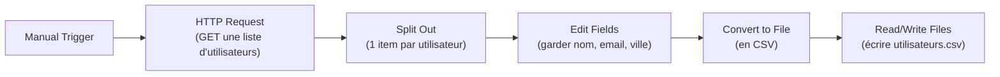
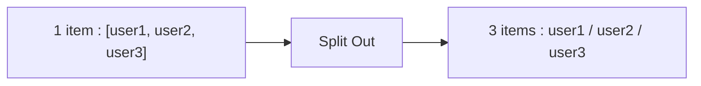
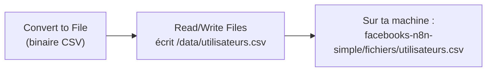

# Leçon 6 — Projet 3 : de l'API vers un fichier (sauvegarder une liste)

> [!TIP]
> **Objectif — Assembler tout ce que tu as appris : aller chercher une liste de données, la traiter, et la _sauvegarder_ sur ta machine.**
>
> Ce document est un **mode d'emploi pas à pas**. On va récupérer une liste d'utilisateurs de démonstration, n'en garder que l'essentiel, et l'écrire dans un fichier **CSV** lisible dans Excel.
>
> Tu trouveras aussi un **workflow importable** : [`workflow-04-api-vers-fichier.json`](workflow-04-api-vers-fichier.json).
>
> À la fin de cette leçon, tu sauras :
> 1. Récupérer une **liste** (plusieurs items) depuis une API et comprendre le **traitement par item**.
> 2. **Choisir et renommer** des champs avec Edit Fields sur plusieurs items à la fois.
> 3. Convertir des données en **CSV** (nœud Convert to File).
> 4. **Écrire un fichier** sur ta machine via le dossier partagé `./fichiers` (nœud Read/Write Files).
> 5. Comprendre le chemin `/data` **dans le conteneur** vs `./fichiers` **sur ta machine**.
>
> Phrase clé : **récupérer → transformer → sauvegarder : c'est le squelette de presque toute automatisation de données.**

---

## Vue d'ensemble du projet



Ce projet réunit la Leçon 4 (HTTP Request) et une nouveauté : **écrire un résultat sur le disque**. On garde un Manual Trigger pour tester tranquillement.

---

# PARTIE 0 — L'API de démonstration

On utilise une API gratuite qui renvoie une **liste** d'utilisateurs fictifs :

```
https://jsonplaceholder.typicode.com/users
```

Teste-la dans ton navigateur : tu verras un **tableau** (entre crochets `[ ]`) contenant 10 utilisateurs. Chaque utilisateur ressemble à :

```json
{
  "id": 1,
  "name": "Leanne Graham",
  "username": "Bret",
  "email": "Sincere@april.biz",
  "address": {
    "street": "Kulas Light",
    "city": "Gwenborough"
  }
}
```

> [!NOTE]
> **Une liste, pas un seul objet.** En Leçon 4, l'API renvoyait **un** objet (une citation). Ici elle renvoie **plusieurs** objets dans un tableau. C'est une différence importante : n8n va devoir traiter **chaque utilisateur séparément**. C'est exactement le « traitement par fiche » de l'analogie de la chaîne de montage (Leçon 1).

---

# PARTIE 1 — Récupérer la liste (HTTP Request)

1. Crée un nouveau workflow.
2. Ajoute un **Manual Trigger** (« Add first step » → Trigger manually).
3. Ajoute un **HTTP Request** à la suite :

| Réglage | Valeur |
|---------|--------|
| **Method** | `GET` |
| **URL** | `https://jsonplaceholder.typicode.com/users` |
| **Authentication** | `None` |

4. Clique **« Execute step »**. Dans la sortie (vue **Table**), tu vois **10 lignes** : n8n a automatiquement transformé le tableau de l'API en **10 items**.

> [!NOTE]
> **n8n « éclate » souvent les tableaux tout seul.** Quand une API renvoie une liste, le nœud HTTP Request crée généralement un item par élément. Si jamais tu obtenais **un seul** item contenant tout le tableau (champ du type `data: [ ... ]`), tu utiliserais le nœud **Split Out** (Partie 2) pour le découper. On l'inclut dans le schéma par sécurité pédagogique.

---

# PARTIE 2 — Découper en items si besoin (Split Out)

Si ta sortie HTTP montre déjà 10 items séparés, **tu peux sauter cette partie**. Sinon, ou pour bien comprendre l'outil :

1. Ajoute un nœud **« Split Out »** après le HTTP Request.
2. Règle :
   - **Fields To Split Out** : le champ contenant le tableau (par ex. `data`). Si toute la réponse **est** le tableau, ce nœud n'est pas nécessaire.

Le rôle de **Split Out** est de transformer **un** item contenant une liste en **plusieurs** items, un par élément de la liste. C'est l'inverse d'« agréger ».



---

# PARTIE 3 — Garder l'essentiel (Edit Fields sur plusieurs items)

On ne veut sauvegarder que **trois colonnes** : le nom, l'email et la ville.

1. Ajoute un nœud **« Edit Fields (Set) »** après le HTTP Request (ou le Split Out).
2. Active **« Keep Only Set Fields »**.
3. Ajoute trois champs en mode **Expression** :

| Name | Type | Value (expression) |
|------|------|--------------------|
| `nom` | String | `={{ $json.name }}` |
| `email` | String | `={{ $json.email }}` |
| `ville` | String | `={{ $json.address.city }}` |

> [!NOTE]
> **Le point pour entrer dans un sous-objet.** L'utilisateur contient un objet `address` qui contient `city`. Pour atteindre la ville, on enchaîne les points : `$json.address.city`. C'est comme ouvrir une boîte (`address`) pour prendre ce qu'il y a dedans (`city`).

4. Clique **« Execute step »**. Le nœud traite **les 10 items d'un coup** : tu obtiens 10 lignes propres avec seulement `nom`, `email`, `ville`. **Un nœud Edit Fields s'applique automatiquement à tous les items entrants** — c'est toute la puissance du traitement par lot.

```json
{ "nom": "Leanne Graham", "email": "Sincere@april.biz", "ville": "Gwenborough" }
```

---

# PARTIE 4 — Convertir en CSV (Convert to File)

Pour obtenir un fichier ouvrable dans Excel, on transforme nos 10 items en un fichier **CSV** (valeurs séparées par des virgules).

1. Ajoute un nœud **« Convert to File »** après le Edit Fields.
2. Règle :
   - **Operation** : `Convert to CSV`.
   - (Options par défaut : n8n prend tous les items et crée un fichier avec une ligne d'en-tête `nom,email,ville` puis une ligne par utilisateur.)
3. Clique **« Execute step »**. La sortie contient maintenant un **fichier binaire** (le CSV), visible dans le panneau de sortie (onglet **Binary**).

> [!NOTE]
> **Données « JSON » vs données « binaires ».** Jusqu'ici, nos items étaient du **texte structuré** (JSON). Un fichier (CSV, image, PDF...) est une donnée **binaire**, rangée à part dans l'item, dans une propriété spéciale (souvent `data`). Le nœud suivant ira chercher ce contenu binaire pour l'écrire sur le disque.

---

# PARTIE 5 — Écrire le fichier sur ta machine (Read/Write Files)

C'est ici que le **volume partagé** configuré en Leçon 2 entre en jeu. Rappelle-toi cette ligne du `docker-compose.yml` :

```yaml
volumes:
  - ./fichiers:/data
```

Elle signifie : le dossier **`/data` à l'intérieur du conteneur** correspond au dossier **`./fichiers` sur ta machine**. Donc, si n8n écrit dans `/data/...`, le fichier apparaît dans `facebooks-n8n-simple/fichiers/...` chez toi.

## 5.1 Ajouter le nœud d'écriture

1. Ajoute un nœud **« Read/Write Files from Disk »** après le Convert to File.
2. Règle :
   - **Operation** : `Write File to Disk`.
   - **File Path and Name** : `/data/utilisateurs.csv`
   - **Input Binary Field** : `data` (le nom de la propriété binaire produite par Convert to File).



## 5.2 Exécuter et vérifier

1. Clique **« Execute workflow »** (le workflow entier).
2. Sur **ta machine**, ouvre le dossier `facebooks-n8n-simple/fichiers/`.
3. Le fichier **`utilisateurs.csv`** est là ! Ouvre-le (Excel, ou un éditeur de texte) :

```csv
nom,email,ville
Leanne Graham,Sincere@april.biz,Gwenborough
Ervin Howell,Shanna@melissa.tv,Wisokyburgh
...
```

> [!NOTE]
> **Pourquoi pas `C:\Users\...` directement ?** Parce que n8n tourne **dans le conteneur**, pas sur Windows. Il ne « voit » que ses propres dossiers, dont `/data`. Le chemin **toujours valable** côté n8n est donc `/data/...`. C'est le volume qui fait le pont vers ton vrai dossier `./fichiers`. Si tu écris un chemin Windows comme `C:\...`, n8n ne le trouvera pas.

---

# PARTIE 6 — Importer le workflow tout fait (optionnel)

1. Menu **« ⋮ »** → **« Import from File... »**.
2. Sélectionne [`workflow-04-api-vers-fichier.json`](workflow-04-api-vers-fichier.json).
3. Clique **« Execute workflow »** et vérifie l'apparition du CSV dans `./fichiers`.

---

# PARTIE 7 — Et pour aller vers Google Sheets ?

Écrire dans un fichier local est le moyen **le plus simple** de sauvegarder, et il ne demande aucune configuration. Si un jour tu veux écrire dans **Google Sheets** à la place :

1. Tu remplaces les nœuds **Convert to File + Read/Write Files** par un seul nœud **« Google Sheets »** (Operation **Append Row**).
2. Tu crées une **credential Google Sheets** (connexion OAuth à ton compte Google).
3. Tu choisis ton document et ta feuille, et tu mappes `nom`, `email`, `ville` sur les colonnes.

Le reste du workflow (HTTP Request → Edit Fields) ne change pas. C'est l'un des grands avantages de n8n : **on remplace la « sortie » sans toucher au reste**.

> [!NOTE]
> **On reste simple pour ce cours.** Google Sheets demande une configuration de compte qui dépasse l'objectif « ultra simple » d'ici. Le fichier CSV local te donne déjà un résultat concret et réutilisable. Garde Google Sheets comme prochaine étape quand tu seras à l'aise.

---

# PARTIE 8 — Erreurs fréquentes et solutions

| Symptôme | Cause probable | Solution |
|----------|----------------|----------|
| `ENOENT` / dossier introuvable | Le dossier `./fichiers` n'existe pas | Crée-le, ou il est créé au 1er `docker compose up` ; écris bien dans `/data/...` |
| Le CSV n'apparaît pas chez moi | Mauvais chemin (ex. `C:\...`) | Utilise `/data/utilisateurs.csv` côté n8n |
| `ville` vide | `address` est un sous-objet | Utilise `{{ $json.address.city }}` |
| Une seule ligne dans le CSV | Le tableau n'a pas été éclaté en items | Ajoute un nœud **Split Out** (Partie 2) |
| `Input Binary Field` introuvable | Mauvais nom de propriété binaire | Mets `data` (vérifie l'onglet Binary du Convert to File) |
| Permission denied à l'écriture | Droits du dossier hôte | Vérifie que `./fichiers` est accessible en écriture |

---

## Recap

> [!TIP]
> **Tu sais maintenant boucler une automatisation de données complète :**
>
> 1. **Récupérer une liste** via HTTP Request et comprendre le **traitement par item**.
> 2. Découper un tableau en items avec **Split Out** (si nécessaire).
> 3. **Sélectionner et renommer** des champs avec Edit Fields, sur tous les items à la fois (`address.city`).
> 4. **Convertir en CSV** avec Convert to File (données binaires).
> 5. **Écrire le fichier** avec Read/Write Files vers `/data/...`, qui apparaît dans `./fichiers` chez toi.
> 6. Comprendre le pont **`/data` (conteneur) ↔ `./fichiers` (ta machine)** via le volume Docker.
>
> **Retiens : récupérer → transformer → sauvegarder, c'est le squelette de presque toute automatisation de données.**

## Et après ce cours ?

> [!TIP]
> **Tu as maintenant les bases solides de n8n.** Tu sais : penser un workflow, l'installer en local avec Docker, déclencher à la main / à l'heure / par webhook, parler aux API, transformer des données et les sauvegarder.
>
> Pour continuer en douceur, voici des **idées de mini-projets** qui ne réutilisent que ce que tu connais déjà :
>
> 1. **Météo du jour** : Schedule Trigger + HTTP Request vers une API météo gratuite → écrire dans un fichier.
> 2. **Carnet de contacts** : Webhook qui reçoit `nom` + `email` → ajoute une ligne dans un CSV.
> 3. **Veille de citations** : Schedule chaque jour → citation (Leçon 4) → ajouter à la fin d'un fichier `citations.csv`.
> 4. **Mini-API perso** : Webhook qui reçoit deux nombres et renvoie leur somme (un nœud Edit Fields avec `{{ Number($json.query.a) + Number($json.query.b) }}`).
>
> Quand tu seras à l'aise, les prochaines grandes étapes sont : les **credentials** (se connecter à Gmail, Slack, Google Sheets, Telegram...), le nœud **IF** pour créer des chemins « si / sinon », et le nœud **Code** pour des transformations sur mesure.
>
> **Bravo — tu n'es plus un débutant complet en automatisation !**
